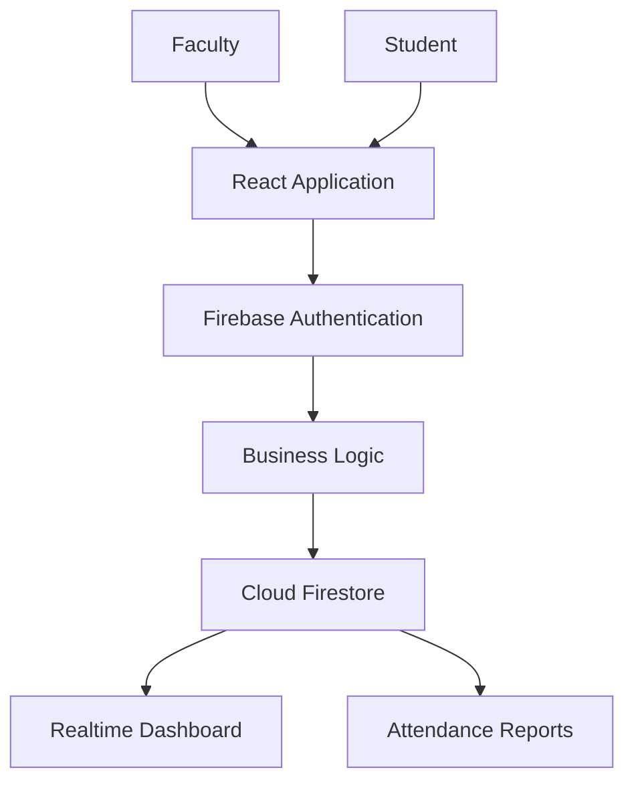
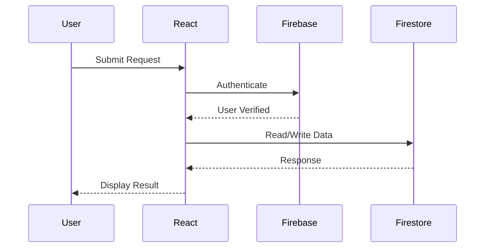
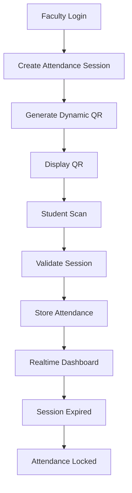

# Smart QR Pro

# System Overview

---

# Document Information

| Property | Value |
|----------|-------|
| Project | Smart QR Pro |
| Version | 1.0 |
| Document | System Overview |
| Status | Draft |

---

# 1. Purpose

This document describes the overall architecture of Smart QR Pro.

It explains how every component of the system interacts, how users access the platform, how data flows through the application, and how the architecture supports scalability, security, maintainability, and future expansion.

This document serves as the foundation for all future architecture documents.

---

# 2. System Overview

Smart QR Pro is a cloud-native Software-as-a-Service (SaaS) application designed for educational institutions.

The platform provides secure QR-based attendance management through a modern web application powered by Firebase services.

The system is designed using modular architecture, allowing new modules to be integrated without requiring major architectural changes.

---

# 3. Architecture Principles

The application follows the following engineering principles.

- Clean Architecture
- Modular Design
- Separation of Concerns
- Security First
- Scalability
- Maintainability
- Reusability
- Cloud Native Development
- Responsive Design
- Enterprise UI/UX

---

# 4. High-Level Architecture

---

# 5. System Components

The application consists of the following major components.

## Client Application

Built using:

- React
- TypeScript
- Vite
- Tailwind CSS

Responsibilities

- User Interface
- Navigation
- Forms
- Dashboard
- QR Scanner
- Reports

---

## Authentication Layer

Implemented using Firebase Authentication.

Responsibilities

- Login
- Logout
- Session Management
- User Identity
- Token Management

---

## Business Logic Layer

Responsible for:

- Attendance Validation
- QR Validation
- Session Validation
- Role Validation
- Attendance Rules

---

## Cloud Firestore

Stores

- Students
- Faculty
- Attendance
- Sessions
- Departments
- Subjects
- Settings

---

## Firebase Hosting

Responsible for

- Application Hosting
- HTTPS
- CDN
- Static Assets

---

# 6. User Roles

Version 1 includes

Super Administrator

Faculty

Student

Each role has its own permissions enforced through Role-Based Access Control.

---

# 7. Request Lifecycle

Every request follows this sequence.

---

# 8. Attendance Lifecycle

---

# 9. Data Flow

The following collections participate in Version 1.

Students

Faculty

Departments

Subjects

Attendance

Sessions

Audit Logs

Settings

Each collection is designed independently to support scalability and maintainability.

---

# 10. Security Layers

The architecture includes multiple security layers.

Layer 1

Firebase Authentication

Layer 2

Role Based Access Control

Layer 3

Protected Routes

Layer 4

Firestore Security Rules

Layer 5

Attendance Validation

Layer 6

Duplicate Prevention

Layer 7

Audit Logs

---

# 11. Scalability Strategy

The application is designed to support

Thousands of students

Multiple departments

Multiple courses

Multiple semesters

Future multi-institution deployment

Future AI modules

without significant architectural changes.

---

# 12. Future Expansion

Future modules include

AI Assistant

Parent Portal

Mobile Application

Face Recognition

Notifications

Learning Analytics

Campus ERP

These modules are intentionally excluded from Version 1 but are considered during architectural planning.

---

# 13. Engineering Decisions

React was selected for its component-based architecture.

Firebase was selected because it provides authentication, hosting, storage, and realtime database capabilities with minimal infrastructure management.

Cloud Firestore provides realtime synchronization while reducing backend complexity.

Tailwind CSS enables a scalable design system with consistent styling.

---

# End of Document