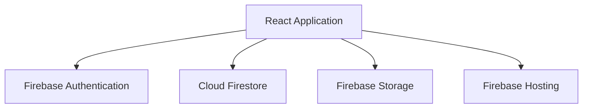
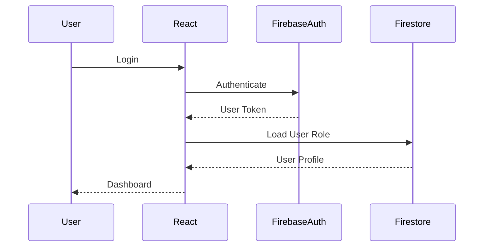

# Smart QR Pro

# Firebase Architecture

---

# Document Information

| Property | Value |
|----------|-------|
| Project | Smart QR Pro |
| Version | 1.0 |
| Document | Firebase Architecture |

---

# 1. Purpose

This document defines how Firebase services are integrated into Smart QR Pro.

Firebase is responsible for:

- User Authentication
- Cloud Firestore Database
- Cloud Storage
- Hosting
- Security Rules

The architecture is designed to support scalability, security, and future expansion.

---

# 2. Firebase Services

Version 1 uses the following Firebase services.

## Firebase Authentication

Responsibilities

- User Login
- User Logout
- Session Management
- Identity Verification
- Role Validation

---

## Cloud Firestore

Stores

- Students
- Faculty
- Departments
- Subjects
- Attendance
- Sessions
- Audit Logs
- Settings

---

## Firebase Storage

Stores

- Institution Logo
- College Logo
- Student Photos (Future)
- QR Assets
- Exported Reports

---

## Firebase Hosting

Hosts

- React Application
- Static Assets
- SSL Certificate
- Global CDN

---

# 3. Firebase Architecture



---

# 4. Firestore Collections

Version 1 Collections

students

faculty

departments

subjects

sessions

attendance

auditLogs

settings

---

# 5. Authentication Flow



---

# 6. Attendance Data Flow

```mermaid
flowchart TD

Faculty --> Session

Session --> QR

QR --> Student

Student --> Authentication

Authentication --> Attendance Validation

Attendance Validation --> Firestore

Firestore --> Dashboard

Dashboard --> Reports
```

---

# 7. Security Principles

The Firebase implementation follows these principles.

- Never trust client input.
- Every request requires authentication.
- Firestore Rules protect all collections.
- Attendance validation occurs before writes.
- Users can only access authorized data.
- Audit logs record critical actions.

---

# 8. Future Expansion

Future Firebase services may include

Cloud Functions

Cloud Messaging

App Check

Analytics

Remote Config

Crashlytics

AI Integrations

---

# End of Document