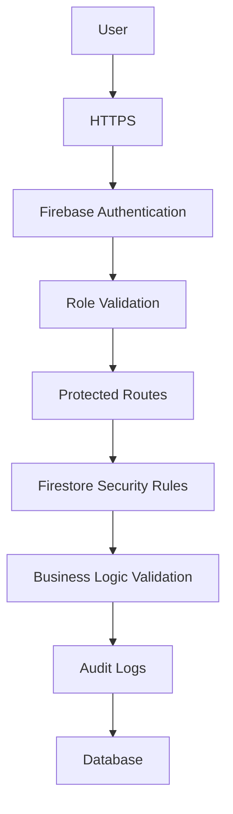

# Smart QR Pro

# Security Architecture

---

# Document Information

| Property | Value |
|----------|-------|
| Project | Smart QR Pro |
| Version | 1.0 |
| Document | Security Architecture |
| Status | Draft |

---

# 1. Purpose

Security is the highest priority of Smart QR Pro.

The objective is to ensure that attendance records remain authentic, confidential, and tamper-resistant while providing a seamless experience for authorized users.

The security architecture follows the principle of **Defense in Depth**, where multiple independent security layers protect the system.

---

# 2. Security Principles

The platform follows these principles:

- Least Privilege Access
- Authentication First
- Role-Based Access Control (RBAC)
- Zero Trust Validation
- Secure by Default
- Audit Everything
- Validate Every Request
- Minimize Sensitive Data Exposure

---

# 3. Security Layers

---

# 4. Authentication

Firebase Authentication is responsible for:

- User Login
- User Logout
- Secure Session Tokens
- Password Management
- Email Verification (Future)

Only authenticated users may access protected pages.

---

# 5. Authorization

Version 1 uses Role-Based Access Control.

Roles

- Super Administrator
- Faculty
- Student

Every API request and Firestore operation must verify the user's role before allowing access.

---

# 6. Protected Routes

Protected pages include:

- Dashboard
- Student Management
- Faculty Management
- Attendance Sessions
- Reports
- Analytics
- Settings

Unauthenticated users are redirected to the login page.

---

# 7. Firestore Security

Firestore Rules enforce:

- Read permissions
- Write permissions
- Update permissions
- Delete permissions

Rules are evaluated on every request.

---

# 8. Attendance Validation

Attendance is accepted only if:

- User is authenticated
- Session exists
- Session is active
- Session has not expired
- Student belongs to the class
- Attendance has not already been submitted

If any validation fails, attendance is rejected.

---

# 9. QR Security

Each QR contains:

- Session ID
- Secure Token
- Expiration Timestamp

QR codes never store:

- Student IDs
- Faculty credentials
- Attendance records
- Personal information

---

# 10. Audit Logging

Critical events are recorded:

- Login
- Logout
- Attendance Submission
- Duplicate Attempt
- Session Creation
- Session Closure
- Unauthorized Access Attempt

Audit logs help identify misuse and support troubleshooting.

---

# 11. Error Handling

Examples:

- Invalid QR
- Expired Session
- Unauthorized Access
- Permission Denied
- Duplicate Attendance
- Session Closed

The system returns clear error messages without exposing internal implementation details.

---

# 12. Future Security Enhancements

Planned improvements include:

- GPS Geofencing
- Device Binding
- Face Recognition
- Liveness Detection
- App Check
- Cloud Functions Validation
- IP Monitoring
- Multi-Factor Authentication
- AI Fraud Detection

---

# 13. Security Goals

Version 1 aims to:

- Prevent unauthorized attendance
- Protect user accounts
- Secure attendance records
- Ensure data integrity
- Support future enterprise security features

---

# End of Document