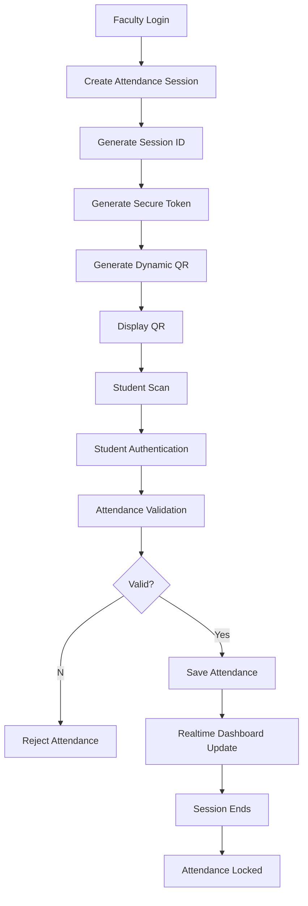
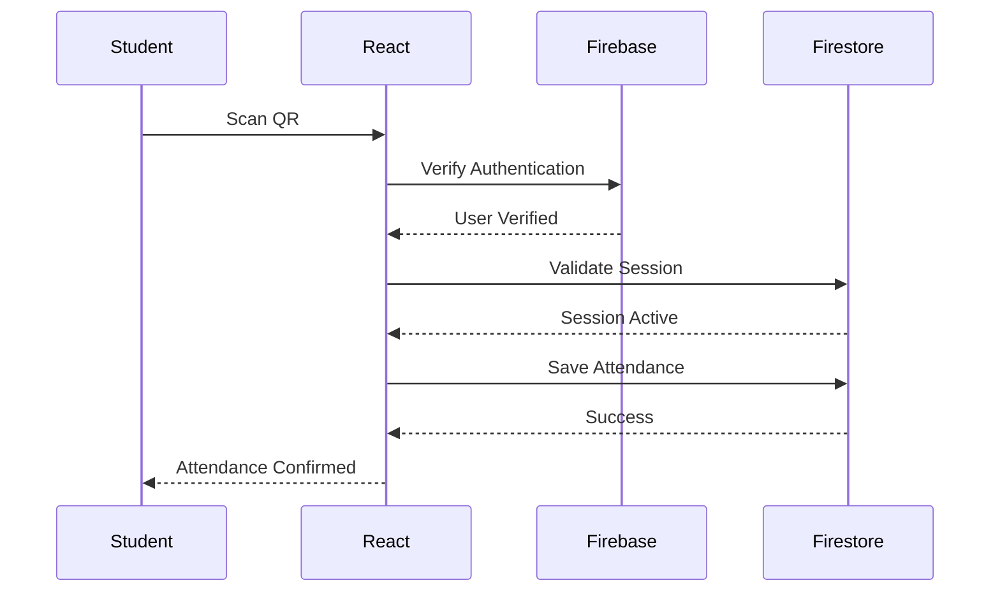

# Smart QR Pro

# Attendance Engine Architecture

---

# Document Information

| Property | Value |
|----------|-------|
| Project | Smart QR Pro |
| Version | 1.0 |
| Document | Attendance Engine |
| Status | Draft |

---

# 1. Purpose

The Attendance Engine is the core subsystem of Smart QR Pro.

Its responsibility is to securely manage attendance sessions, generate dynamic QR codes, validate attendance requests, prevent fraudulent submissions, and update attendance records in real time.

The engine is designed to be secure, scalable, and extensible for future AI-powered attendance validation.

---

# 2. Objectives

The Attendance Engine must:

- Eliminate proxy attendance.
- Prevent duplicate attendance.
- Support secure QR sessions.
- Validate attendance server-side.
- Store attendance in Firestore.
- Update dashboards in real time.
- Support thousands of students.
- Maintain audit logs.

---

# 3. Attendance Lifecycle

---

# 4. Attendance Session

Each attendance session contains:

- Session ID
- Faculty ID
- Subject
- Department
- Section
- Semester
- Date
- Start Time
- End Time
- Expiration Time
- QR Token
- Attendance Count
- Session Status

Every session is unique.

---

# 5. QR Generation

Every attendance session generates a unique QR.

The QR contains:

- Session ID
- Signed Session Token
- Expiration Timestamp

The QR never contains student information.

---

# 6. Student Attendance Flow

---

# 7. Validation Rules

Before attendance is accepted, the system validates:

- Student is authenticated.
- Session exists.
- Session is active.
- Session is not expired.
- Student belongs to the selected section.
- Student has not already submitted attendance.

Only if all validations pass is attendance stored.

---

# 8. Duplicate Prevention

The system prevents duplicate attendance by checking:

- Student ID
- Session ID

If a matching attendance record already exists, the submission is rejected.

---

# 9. Attendance Status

Possible statuses:

Present

Absent

Late (Future)

Excused (Future)

Medical Leave (Future)

---

# 10. Session Expiration

Every session has an expiration time.

Once expired:

- QR becomes invalid.
- Attendance submissions are rejected.
- Session status changes to Closed.

---

# 11. Audit Logging

Every important attendance event is recorded.

Examples:

- Session Created
- QR Generated
- Attendance Submitted
- Duplicate Attempt
- Session Closed

---

# 12. Error Handling

Possible errors:

Invalid QR

Expired Session

Duplicate Attendance

Unauthorized Student

Authentication Failed

Session Closed

Each error returns a clear message to the user.

---

# 13. Future Enhancements

Version 2 may include:

- GPS Verification
- Device Binding
- Face Recognition
- Bluetooth Validation
- AI Fraud Detection
- Attendance Prediction

---

# 14. Engineering Decisions

Attendance validation is always performed after user authentication.

Attendance data is written only after successful validation.

The QR code contains no sensitive student information.

Business rules are enforced by the application logic and Firestore security rules.

---

# End of Document