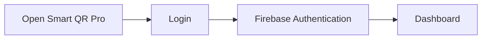
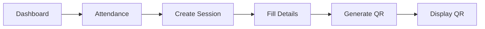
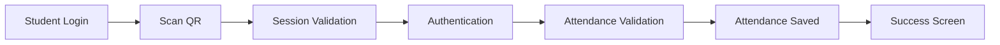
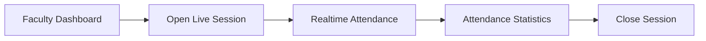
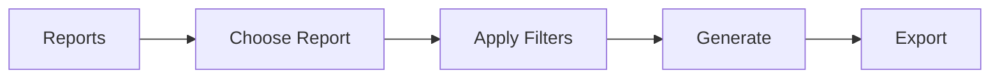
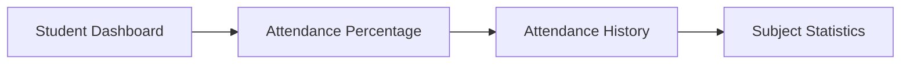
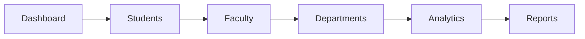

# Smart QR Pro

# User Journeys

---

# Purpose

This document defines the complete user journeys for every major user of Smart QR Pro.

It describes how users interact with the application from login to completing their tasks.

These journeys guide UI/UX design, feature implementation, and testing.

---

# User Journey 1 – Faculty Login

### Steps

1. Open application.
2. Enter email and password.
3. Authenticate with Firebase.
4. Redirect to dashboard.

---

# User Journey 2 – Create Attendance Session

### Steps

1. Open Attendance.
2. Click Create Session.
3. Select

- Subject
- Department
- Section
- Semester
- Duration

4. Click Generate.
5. QR appears.
6. Session becomes active.

---

# User Journey 3 – Student Attendance

### Steps

1. Login.
2. Scan QR.
3. Validate session.
4. Validate user.
5. Save attendance.
6. Show confirmation.

---

# User Journey 4 – Live Attendance Monitoring

### Steps

1. Faculty opens active session.
2. Students appear live.
3. Dashboard updates automatically.
4. Faculty ends session.

---

# User Journey 5 – Generate Reports

### Steps

1. Open Reports.
2. Select report type.
3. Choose filters.
4. Generate report.
5. Export as PDF, Excel, or CSV.

---

# User Journey 6 – Student Dashboard

Students can:

- View attendance percentage.
- View attendance history.
- Track subject attendance.

---

# User Journey 7 – Administrator

Administrator responsibilities:

- Manage institution data.
- View analytics.
- Export reports.
- Configure settings.

---

# Future User Journeys

Version 2 may include:

- Parent Dashboard
- AI Chatbot
- Face Recognition
- Push Notifications
- Mobile App

---

# End of Document