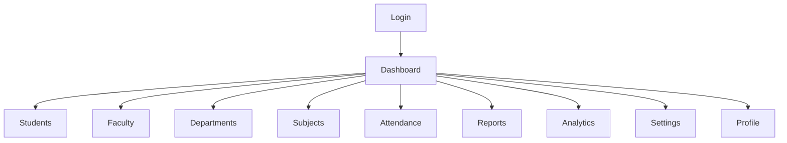

# Smart QR Pro

# Navigation System

---

# Document Information

| Property | Value |
|----------|-------|
| Project | Smart QR Pro |
| Version | 1.0 |
| Document | Navigation System |
| Status | Draft |

---

# Purpose

This document defines the navigation structure of Smart QR Pro.

It specifies how users move throughout the application and ensures a consistent navigation experience across all modules.

---

# Application Structure

---

# Main Navigation

The sidebar contains:

- Dashboard
- Students
- Faculty
- Departments
- Subjects
- Attendance
- Reports
- Analytics
- Settings

The profile menu is displayed in the top navigation bar.

---

# Dashboard

Purpose

Provide an overview of the institution.

Pages

- Overview
- Today's Attendance
- Quick Actions
- Recent Sessions
- Notifications

---

# Students Module

Purpose

Manage student records.

Pages

- Student List
- Student Details
- Attendance History
- Attendance Percentage

Actions

- Search
- Filter
- View Profile

---

# Faculty Module

Purpose

Manage faculty information.

Pages

- Faculty List
- Faculty Profile
- Assigned Subjects

Actions

- Add Faculty
- Edit Faculty
- Delete Faculty

---

# Departments Module

Purpose

Manage departments.

Pages

- Department List
- Department Details

---

# Subjects Module

Purpose

Manage subjects.

Pages

- Subject List
- Subject Details

---

# Attendance Module

Purpose

Conduct attendance sessions.

Pages

- Create Session
- Active Session
- Session History
- Session Details

Actions

- Generate QR
- Close Session
- Monitor Attendance

---

# Reports Module

Purpose

Generate attendance reports.

Pages

- Daily Report
- Weekly Report
- Monthly Report
- Semester Report
- Student Report
- Faculty Report
- Department Report

Actions

- Generate
- Export PDF
- Export Excel
- Export CSV

---

# Analytics Module

Purpose

Visualize attendance data.

Pages

- Attendance Trends
- Student Analytics
- Faculty Analytics
- Department Analytics

Charts

- Line Chart
- Bar Chart
- Pie Chart

---

# Settings Module

Purpose

Configure application settings.

Pages

- Institution Settings
- User Management
- Security
- Appearance
- Backup

---

# Profile

Pages

- Personal Information
- Change Password
- Logout

---

# Navigation Rules

- Sidebar remains visible on desktop.
- Sidebar collapses on tablet.
- Mobile devices use a navigation drawer.
- Current page is highlighted.
- Breadcrumbs appear on inner pages.

---

# Future Navigation

Version 2 may include

- Parent Portal
- AI Assistant
- Placement
- Hostel
- Library
- Innovation Portal
- Campus ERP

---

# End of Document